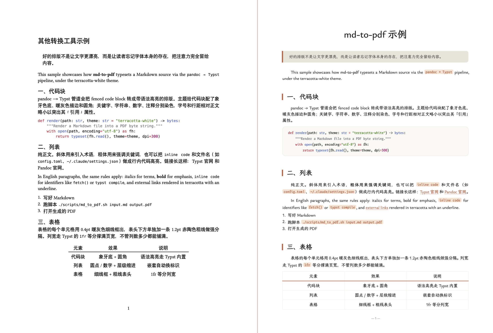

<h1 align="center">md-to-pdf</h1>

<p align="center"><em>markdown goes in, typography comes out</em></p>

<p align="center">
  <a href="https://github.com/WeAIClub/md-to-pdf/stargazers"></a>
  <a href="https://github.com/WeAIClub/md-to-pdf/commits/main"></a>
  <a href="./LICENSE"></a>
</p>

<p align="center">
  <a href="#install">Install</a> ·
  <a href="#quick-start">Quick start</a> ·
  <a href="#themes">Themes</a> ·
  <a href="#use-as-a-claude-code-skill">As a skill</a> ·
  <a href="#use-with-other-ai-clis">AI CLIs</a> ·
  <a href="#credits">Credits</a>
  &nbsp;|&nbsp;
  <strong>English</strong> · <a href="./README.zh.md">中文</a>
</p>

---

<p align="center">
  <a href="./examples/sample.pdf">
    
  </a>
  <br>
  <sub><i>Left: plain <code>pandoc --pdf-engine=typst</code>. Right: same source through md-to-pdf. Click for the full PDF.</i></sub>
</p>

A `pandoc → Typst` pipeline with pre-designed themes and bundled fonts — serif typography, terracotta accents, warm white page, no system font installation needed.

## Features

- ✨ **Two pre-designed themes**: `terracotta-white` (recommended) and `terracotta-white-bold` — warm white page, terracotta accents, serif typography
- 📦 **Fonts bundled**: loaded via `typst --font-path`; no need to install anything into your system font directory
- 🤖 **Works as a Claude Code skill** out of the box (see below), and as a plain CLI for any other AI agent (Gemini CLI, Codex CLI, Qoder, Cursor…) or human user
- 🧩 **Easy to theme**: one `theme.typ` file per theme; drop in your own and pass it as the third argument

## Install

You need **pandoc ≥ 3.2** (the Typst writer was added in 3.2) and **typst** on your `PATH`.

**macOS (Homebrew):**
```bash
brew install pandoc typst
```

**Linux (Debian/Ubuntu):**
```bash
sudo apt install pandoc
# Install typst from a precompiled binary:
# https://github.com/typst/typst/releases
```

**Linux (Arch):**
```bash
sudo pacman -S pandoc typst
```

> **Windows** is not officially supported (the script is bash). Git Bash or WSL should work but is untested.

## Quick start

```bash
git clone https://github.com/WeAIClub/md-to-pdf
cd md-to-pdf
./scripts/md_to_pdf.sh examples/sample.md out.pdf
open out.pdf      # macOS (use xdg-open on Linux)
```

## Usage

```bash
./scripts/md_to_pdf.sh <input.md> <output.pdf> [theme]
```

| Argument | Description |
|---|---|
| `input.md` | Path to the Markdown source (absolute or relative) |
| `output.pdf` | Destination PDF path |
| `theme` | Optional theme name. Defaults to `terracotta-white`. |

Successful runs print `[OK] /absolute/path.pdf`.

## Themes

| Theme | Notes |
|---|---|
| `terracotta-white` | **Recommended.** Default bold weight. Soft synthetic bold on fonts without native 700. |
| `terracotta-white-bold` | Same design, but `**bold**` uses stroke-based synthetic bold for stronger emphasis. |

See each theme's `README.md` for its full typography table.

## Use as a Claude Code skill

Clone this repo into your Claude Code skills directory and Claude will pick it up automatically:

```bash
git clone https://github.com/WeAIClub/md-to-pdf ~/.claude/skills/md-to-pdf
```

After that, tell Claude something like *"turn handoff.md into a pdf"* and it will invoke the skill.

## Use with other AI CLIs

Works with any agent that can read a repo and run a shell command — Gemini CLI, Codex CLI, Qoder, Cursor, and others. See [`AGENTS.md`](./AGENTS.md) for the short, agent-facing spec describing when and how to invoke the skill.

## Add your own theme

1. Create `themes/<your-theme>/theme.typ`
2. Define the required `#set` and `#show` rules (use `themes/terracotta-white/theme.typ` as a reference — you need color tokens, page setup, text/paragraph defaults, heading rules, strong/emph/link, raw inline/block, quote, table, and a `#let horizontalrule = ...` definition)
3. Run: `./scripts/md_to_pdf.sh input.md output.pdf <your-theme>`

See [`SKILL.md`](./SKILL.md) for the full checklist of required `theme.typ` hooks.

## Architecture

```
md-to-pdf/
├── SKILL.md                     # Claude Code skill entry
├── AGENTS.md                    # Spec for other AI agents
├── README.md / README.zh.md     # Human docs
├── LICENSE                      # MIT (project code)
├── scripts/md_to_pdf.sh         # Main pipeline
├── themes/                      # One directory per theme
│   ├── terracotta-white/
│   └── terracotta-white-bold/
├── fonts/                       # Bundled fonts + OFL license
└── examples/
    ├── sample.md
    └── sample.pdf
```

Pipeline:
1. `pandoc input.md --to typst` → Typst body fragment
2. Post-process `columns: N` → `columns: (1fr,)*N` so tables span the page
3. Concatenate `theme.typ + body.typ` into a single Typst file
4. `typst compile --font-path fonts/`

## Credits

- **Fonts** — [LXGW Bright GB](https://github.com/lxgw/LxgwBright) and [LXGW Bright Code GB](https://github.com/lxgw/LxgwBright-Code) by LXGW (陈亿堃), licensed under SIL Open Font License 1.1. See [`fonts/LICENSE-LXGW.txt`](./fonts/LICENSE-LXGW.txt) for full copyright notices.
- **Design reference** — each theme directory includes a `DESIGN.md` that the theme draws its palette and typography from; sources are documented in the first comment of each file.
- **Pipeline** — [pandoc](https://pandoc.org) and [typst](https://typst.app) do all the heavy lifting.

## License

Project code and themes: [MIT](./LICENSE).

Bundled fonts: [OFL 1.1](./fonts/LICENSE-LXGW.txt).
