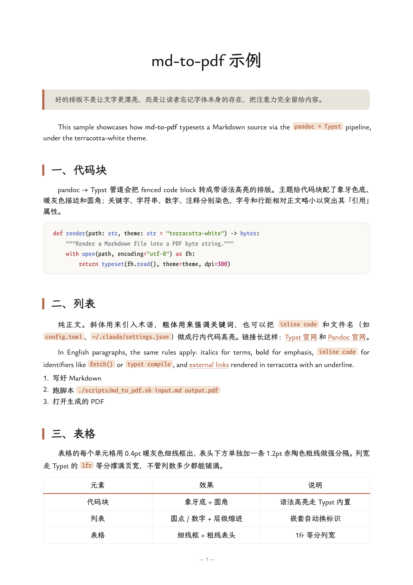

<h1 align="center">md-to-pdf</h1>

<p align="center"><em>markdown goes in, typography comes out</em></p>

<p align="center">
  <a href="https://github.com/WeAIClub/md-to-pdf/stargazers"></a>
  <a href="https://github.com/WeAIClub/md-to-pdf/commits/main"></a>
  <a href="./LICENSE"></a>
</p>

<p align="center">
  <a href="#安装">安装</a> ·
  <a href="#用法">用法</a> ·
  <a href="#主题">主题</a> ·
  <a href="#自定义主题">自定义主题</a> ·
  <a href="#架构">架构</a>
  &nbsp;|&nbsp;
  <a href="./README.md">English</a> · <strong>中文</strong>
</p>

---

<p align="center">
  <a href="./examples/sample.pdf">
    
  </a>
  <br>
  <sub><i>同一份 Markdown 走 md-to-pdf 用 <code>claude-white</code> 主题渲染的效果。点击查看完整 PDF。</i></sub>
</p>

一条 `pandoc → Typst` 管道，配两套预设主题和打包好的字体 —— 衬线字体、赤陶色点缀、暖白页面，不需要往系统里装字体。

## 安装

你需要把 **pandoc ≥ 3.2**（Typst writer 是 pandoc 3.2 才加的）和 **typst** 放到 `PATH` 里。

```bash
# macOS
brew install pandoc typst

# Linux（Arch）
sudo pacman -S pandoc typst

# Linux（Debian/Ubuntu）：pandoc 走 apt，typst 从官方预编译二进制装：
# https://github.com/typst/typst/releases
```

### Claude Code

直接 clone 到 Claude Code 的 skills 目录：

```bash
mkdir -p ~/.claude/skills
git clone https://github.com/WeAIClub/md-to-pdf ~/.claude/skills/md-to-pdf
```

### OpenCode

```bash
mkdir -p ~/.config/opencode/skills
git clone https://github.com/WeAIClub/md-to-pdf ~/.config/opencode/skills/md-to-pdf
```

> **小提示：** OpenCode 也会扫 `~/.claude/skills/`，所以只 clone 到 `~/.claude/skills/md-to-pdf` 一处也能两边都生效。

### 其他 AI Agent

任何能读仓库 + 跑 shell 命令的 Agent 都行 —— Gemini CLI、Codex CLI、Qoder、Cursor 等。把仓库 clone 到你放工具的地方，让 Agent 读 [`AGENTS.md`](./AGENTS.md)，那是一份给 Agent 看的简短说明。

## 用法

### Slash 命令

```
/md-to-pdf input.md output.pdf [theme]
```

`theme` 可选，默认 `claude-white`。成功时打印 `[OK] /绝对/路径.pdf`。

### 自然语言

直接对 Agent 说人话就行 —— skill 会通过 trigger 描述自动被识别：

- "把 `report.md` 转成 PDF"
- "把这份笔记打印成 PDF，用 `claude-white-bold` 主题"
- "turn `report.md` into a pdf"
- "make `notes.md` printable with the `claude-white-bold` theme"

## 主题

| 主题 | 说明 |
|---|---|
| [`claude-white`](./themes/claude-white/) | **推荐**。暖白底、赤陶点缀、衬线字体。合成粗体偏柔，适合大段正文。 |
| [`claude-white-bold`](./themes/claude-white-bold/) | 同款设计语言，`**bold**` 改用描边合成粗体，对比更强。 |

> 🚧 **持续更新中** —— vercel、notion、linear、mintlify 等主题已在路上。Watch 仓库追新，或开 issue 提需求。

## 自定义主题

加新主题被刻意设计得**很快**：你只需要写一份 `DESIGN.md`，剩下的 `theme.typ` 让 AI Agent 帮你写。

### 第一步 —— 写 `DESIGN.md`

新建 `themes/<你的主题>/DESIGN.md`。这是一份自由格式的 Markdown，描述视觉语言 —— 配色、字体栈、间距、各级标题、代码块、表格样式等等。你可以扒任何开源设计系统的 spec（Vercel、Notion、Linear、Mintlify……）粘进去，或者自己写。

### 第二步 —— 让 Agent 生成 `theme.typ`

在 Claude Code（或任意 coding agent）里打开仓库，对它说：

> 先读 `themes/claude-white/DESIGN.md` 和 `themes/claude-white/theme.typ`，搞清楚一份 DESIGN.md 是怎么被翻译成 Typst 主题文件的。然后读 `themes/<你的主题>/DESIGN.md`，照同样的约定生成 `themes/<你的主题>/theme.typ`。

[`SKILL.md`](./SKILL.md) 里列了 `theme.typ` 必须实现的 hook（`#set page`、`#show heading`、`#let horizontalrule` 等等），Agent 应该会自动读到。

### 第三步 —— 用上新主题

```
/md-to-pdf input.md output.pdf <你的主题>
```

或者自然语言：「把 `input.md` 转成 PDF，用 `<你的主题>` 主题」。

做出来不错的主题欢迎提 PR。

## 架构

```
md-to-pdf/
├── SKILL.md                     # Skill 入口（frontmatter + 说明）
├── AGENTS.md                    # 给非 Claude Agent 的说明
├── README.md / README.zh.md     # 给人看的文档
├── LICENSE                      # MIT（项目代码）
├── scripts/md_to_pdf.sh         # 主管道脚本
├── themes/                      # 每个主题一个目录
│   ├── claude-white/
│   │   ├── DESIGN.md            # 设计参考
│   │   ├── theme.typ            # Typst 模板
│   │   └── README.md            # 排版说明
│   └── claude-white-bold/
├── fonts/                       # 打包字体 + OFL license
└── examples/                    # sample.md + sample.pdf + 截图
```

管道：
1. `pandoc input.md --to typst` → Typst body fragment
2. 后处理 `columns: N` → `columns: (1fr,)*N`，让表格撑满页宽
3. 把 `theme.typ + body.typ` 拼成单个 Typst 文件
4. `typst compile --font-path fonts/`

## 许可证

项目代码和主题：[MIT](./LICENSE)。

打包字体 —— [LXGW Bright GB](https://github.com/lxgw/LxgwBright) 和 [LXGW Bright Code GB](https://github.com/lxgw/LxgwBright-Code)，作者陈亿堃（LXGW），[SIL OFL 1.1](./fonts/LICENSE-LXGW.txt) 授权。

`claude-white` 主题的配色和排版来自 Anthropic Claude 的设计语言，原始 spec 保存在 `themes/claude-white/DESIGN.md`。
